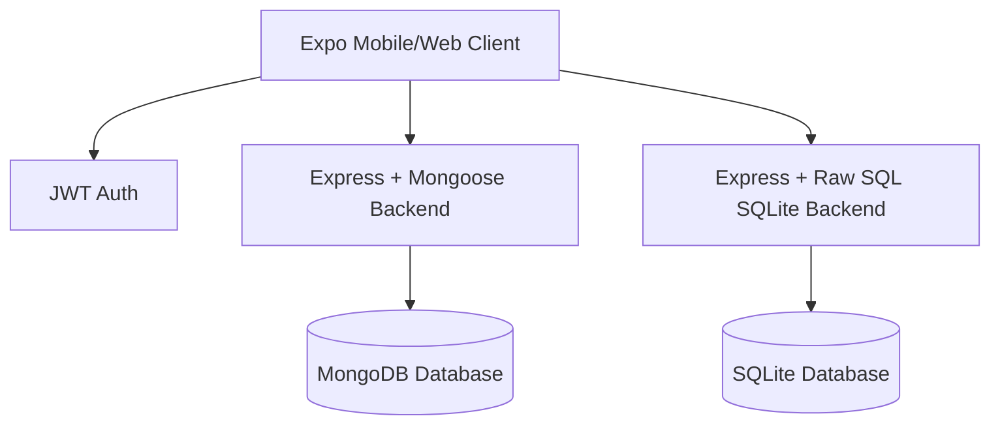

# 📚 Book Review App

A full-stack, state-of-the-art **Book Review & Recommendation Application** featuring a cross-platform mobile interface (React Native/Expo) powered by two interchangeable backends: **MongoDB (Node/Express)** and **SQLite (Express + Prisma with Raw SQL)**.

---

## ✨ Features

- **🛡️ Secure User Authentication**: JWT-based register & login with client-side state management (Zustand) and automatic auth interceptor headers.
- **📖 Book Feed & Recommendation Engine**: Paginated infinite scrolling feed of books with a dedicated user recommendation dashboard.
- **💬 Separate Likes & Comments**: Dedicated tables/collections for book likes and comments, facilitating clean relational modeling and post links.
- **⚡ Raw SQL Integration**: The SQLite backend handles all operations, relations, aggregates, and lookups using **pure raw SQL** queries.
- **📁 Cloudinary Cover Uploads**: Multipart image uploads directly integrated with Cloudinary or base64 local fallback.
- **🎨 Premium Visuals**: Beautiful dark mode and HSL tailoring, micro-animations, star ratings, and fully responsive/scrollable web and mobile interfaces.

---

## 🏗️ Project Architecture



### Repo Layout
- **mobile/** — React Native Expo cross-platform client app.
- **backend/** — Node.js Express server using Mongoose & MongoDB.
- **backend-sql/** — Node.js Express server using Prisma and Raw SQL queries on SQLite.

---

## 🗄️ Database Schemas (Likes & Comments Split)

### SQL Database (SQLite)
Implemented using Prisma. Relation models `Like` and `Comment` map explicitly to individual tables with cascade deletion rules:

```prisma
model Like {
  id        String   @id @default(uuid())
  userId    String
  bookId    String
  user      User     @relation(fields: [userId], references: [id], onDelete: Cascade)
  book      Book     @relation(fields: [bookId], references: [id], onDelete: Cascade)
  createdAt DateTime @default(now())

  @@unique([userId, bookId])
}

model Comment {
  id        String   @id @default(uuid())
  text      String
  userId    String
  bookId    String
  user      User     @relation(fields: [userId], references: [id], onDelete: Cascade)
  book      Book     @relation(fields: [bookId], references: [id], onDelete: Cascade)
  createdAt DateTime @default(now())
  updatedAt DateTime @updatedAt
}
```

### MongoDB Database
Modeled using separate collections for `Like` and `Comment` with indexing:
```javascript
// Like Schema
{
  user: { type: ObjectId, ref: 'User', required: true },
  book: { type: ObjectId, ref: 'Book', required: true }
}
// Unique Index: { user: 1, book: 1 }
```

---

## 🚀 API Endpoints

### 🔑 Authentication
- `POST /api/auth/register` — Create a new account.
- `POST /api/auth/login` — Sign in and receive token.

### 📚 Books (CRUD)
- `GET /api/books` — Get paginated book feed.
- `GET /api/books/user` — Fetch books posted by the logged-in user.
- `GET /api/books/:id` — Get specific book details.
- `POST /api/books` — Add a new book (Multipart image/form data).
- `PUT /api/books/:id` — Update book properties.
- `DELETE /api/books/:id` — Delete a book post.

### ❤️ Likes & Comments (Separate Files)
- `PUT /api/likes/:bookId` — Toggle like/unlike status.
- `GET /api/comments/:bookId` — Retrieve comment thread for a book.
- `POST /api/comments/:bookId` — Post a new comment.

---

## 🛠️ Installation & Setup

### 1. Prerequisites
- Node.js (v18+)
- MongoDB (for MongoDB backend)

### 2. Environment Variables
Create a `.env` file in the root of the active backend folder using the following keys:
```env
PORT=5000
MONGO_URI=mongodb://127.0.0.1:27017/library
JWT_SECRET=your_super_jwt_secret
CLOUDINARY_CLOUD_NAME=your_cloudinary_name
CLOUDINARY_API_KEY=your_cloudinary_key
CLOUDINARY_API_SECRET=your_cloudinary_secret
```

### 3. Running Backends

#### Option A: MongoDB Backend
```bash
cd backend
npm install
node scripts/seed.js # Seed initial data
npm run dev
```

#### Option B: SQLite / SQL Backend
```bash
cd backend-sql
npm install
npx prisma db push   # Sync database tables
node scripts/seed.js # Seed SQL likes & comments
npm run dev
```

### 4. Running Mobile Client (Expo)
```bash
cd mobile
npm install
npm run web          # Launches browser client
# or
npx expo start       # Launches Expo CLI for iOS/Android
```